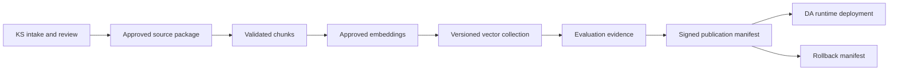

# Master Project Blueprint

**Classification:** AUTHORITATIVE
**Authority:** Single project-control source
**Effective:** 2026-07-31

## 1. Executive summary

This repository governs two products. **Denge Atlası (DA)** is the adult, self-report,
source-grounded mobile experience and its runtime API. **Knowledge Studio (KS)** is a
separate administrator/reviewer control system that prepares versioned knowledge
artifacts. They may share infrastructure and schemas, but have separate roadmaps,
releases, data access, and security boundaries.

The DA feature baseline through historical Sprint 08 is implemented and automated tests
exist. Sprint 09 security/evaluation is partial. No production corpus, production
embedding decision, verified collection, legal approval, completed manual red-team, or
production release exists. Uncommitted `backend/ingestion` and `data/source-library`
content are prototype/intake work, not an approved Knowledge Studio release.

## 2. Verified implementation status

| Area | Verified status | Evidence |
|---|---|---|
| React Native application | VERIFIED_COMPLETE feature baseline | `apps/mobile/src`, 12 Jest suites |
| FastAPI health/search/analysis/temperament | VERIFIED_COMPLETE for tested contracts | `services/api/app`, API tests |
| Local journal and native TTS | VERIFIED_COMPLETE in automated scope | mobile code/tests; device checklist remains manual |
| Synthetic source indexing/retrieval | VERIFIED_COMPLETE as test infrastructure | RAG modules and synthetic fixtures |
| Evaluation framework | VERIFIED_COMPLETE, non-production | 103 controlled cases; commit `34e56e2` |
| Production source governance | VERIFIED_PARTIAL | gates/models exist; approvals and corpus absent |
| Knowledge Studio | VERIFIED_PARTIAL | KS-01 local registry/intake implemented; admin and later lifecycle absent |
| Production release | BLOCKED | Sprint 09 closure and vulnerability reports |

## 3. Current production blockers

- Exact Marifetname and Ibn Sina editions, provenance, rights, and human approvals absent.
- ADR-010 embedding model remains proposed.
- Production chunks, embeddings, collection, evaluation, backup, restore, and rollback absent.
- Manual red-team: 0 of 32 cases human-executed at last recorded audit.
- High/critical dependency findings remain unresolved or unaccepted by authorized humans.
- Production LLM/provider, hosting, signing, monitoring, and store disclosures are undecided.

## 4. Product separation

| Concern | Denge Atlası | Knowledge Studio |
|---|---|---|
| Users | Adults using self-report journeys | Administrators and assigned reviewers |
| Runtime | Mobile + FastAPI + published collection | Admin workflows and offline/background jobs |
| Inputs | User query and local journal on explicit action | Source files, evidence, reviewer decisions |
| Reads | Published version only | Intake through publication workspaces |
| Writes | Local SQLite; bounded API operations | Registry, review evidence, artifacts, manifests |
| Release | App/backend release | Corpus publication |
| Availability coupling | Must run without KS | May publish artifacts consumed later by DA |

## 5. Repository architecture

```text
apps/mobile/           PRODUCT A client
services/api/          PRODUCT A runtime API and current shared RAG primitives
packages/api-client/   DA OpenAPI contract
backend/ingestion/     committed KS-01 registry/intake boundary; no production authority
data/source-library/   local intake; documents excluded from Git
evaluation/            framework-validation assets, not production evidence
docs/                  governance, architecture, audit, and historical evidence
```

Future KS code must receive an explicit root/package boundary and must not be mounted into
DA runtime merely for convenience.

## 6. Shared-platform components

Eligible shared contracts are immutable IDs, checksums, source/chunk metadata schemas,
publication manifests, evaluation result schemas, security utilities, and observability
formats. DA APIs, admin APIs, review databases, source binaries, and work queues are not
shared runtime components. Ownership and versioning must be explicit.

## 7. Product boundary and integration contract



Only the following cross the boundary: source-registry export, approved metadata, approved
chunks, model/config identifiers, collection version, citation metadata, fingerprints,
evaluation and safety reports, publication and rollback manifests. DA must never read
incoming files, unreviewed OCR, discovery results, legal queues, rejected sources, or
admin-only astrology collections.

## 8. Source-governance rules

Marifetname is primary. Ibn Sina is supplementary only where the primary source is
incomplete or unclear. Balkhi, Ghazali, Miskawayh, Kutadgu Bilig, and other sources require
explicit approval. Jung, MBTI, Enneagram, Silva, modern personality testing, Western
astrology, and clinical interpretation are excluded as independent frameworks.

No face/emotion inference, third-party or child profiling, fate prediction, medical
diagnosis/treatment, medication change, or unsupported health claim is permitted.
Health-adjacent history must be uncertain, contextual, general-wellbeing oriented, cited,
and carry the modern medical notice.

## 9. Canonical lifecycle states

Status dimensions are independent; one overloaded `READY_FOR_RAG` field is prohibited.

| Dimension | Canonical states |
|---|---|
| Intake | DISCOVERED → REGISTERED → ORIGINAL_PRESERVED |
| OCR | NOT_REQUIRED / PENDING → EXTRACTED → HUMAN_REVIEWED; FAILED |
| Legal | PENDING → CLEARED / RESTRICTED / REJECTED |
| Subject | PENDING → APPROVED / CHANGES_REQUIRED / REJECTED |
| Safety | PENDING → APPROVED / RESTRICTED / REJECTED |
| Chunk | NOT_STARTED → GENERATED → HUMAN_REVIEWED / REJECTED |
| Embedding | BLOCKED → ELIGIBLE → GENERATED → VERIFIED / FAILED |
| Evaluation | NOT_STARTED → RUNNING → PASSED / FAILED |
| Publication | UNPUBLISHED → CANDIDATE → PUBLISHED → SUPERSEDED / ROLLED_BACK |
| Record | ACTIVE / REJECTED / ARCHIVED |

Every transition records actor role, timestamp, prior/new state, reason, evidence pointer,
and artifact fingerprint. Legal, subject, safety, and final publication decisions are
human actions. Rejected records may only move to ARCHIVED or reopen through an audited
human decision. PUBLISHED is reversible only through versioned rollback, never mutation.
Detailed entry/exit rules are in the KS source lifecycle.

## 10. Knowledge publication flow

Discovery cannot publish. Registration freezes checksum and provenance. Originals are
immutable. OCR preserves original and normalized text separately. Legal, subject, safety,
and chunk reviews must independently pass. Embeddings use an accepted, pinned model.
Evaluation binds to exact artifact hashes. Publication is an atomic manifest-controlled
promotion. Rollback selects a prior immutable manifest.

## 11. Security boundaries

KS is administrator-only and requires future authentication, RBAC, least privilege,
malware/file validation, sandboxed workers, secret isolation, tamper-evident audit events,
network egress control, and protected backups. Research content is untrusted data and
cannot issue instructions. DA retains size/rate guards, strict contracts, citation
validation, source filtering, safe failures, and non-root container execution.

## 12. Privacy boundaries

DA journal content remains device-local unless the adult explicitly requests analysis; it
must not enter analytics or logs. KS must contain no DA user/journal data. Reviewer
identities and legal evidence require access control and retention rules. Source binaries
and generated OCR stay outside Git unless rights explicitly permit repository storage.

## 13. Legal-review requirements

An exact edition requires publisher, publication year, rights holder, jurisdiction,
license/legal basis, permitted environments/uses, restrictions, provenance, evidence,
reviewer role, decision date, expiry/review date, and rationale. Author age or an assumed
public-domain work does not clear a modern edition, scan, transcription, or translation.

## 14. Human-review requirements

Separate recorded decisions are required for OCR/transcription, subject content,
copyright/legal, safety, chunks, evaluation labels, and final publication. A person may
hold multiple roles, but decisions cannot be collapsed. Agents may prepare evidence but
cannot sign approvals.

## 15. Evaluation strategy

Phase A is `FRAMEWORK_VALIDATION_ONLY / NOT_PRODUCTION_EVIDENCE` and validates mechanics.
Phase B uses approved corpus versions and reviewed cases. Targets progress from 100 to 300
to 1,000+ cases. Required measures include Recall@5, MRR, routing, citation correctness
and completeness, unsupported claims, insufficiency, medical/injection/out-of-scope
safety, latency, errors, and reviewer findings.

## 16. Release strategy

DA release and corpus publication are independent. DA requires tested binaries, API
compatibility, privacy disclosure, signing, monitoring, security review, human red-team,
and rollback. Corpus publication requires legal/OCR/subject/safety/chunk approvals,
accepted embeddings, production evaluation, manifest integrity, backup, restore, rollback,
and human publication authority. Neither gate implies the other.

## 17. Risk register

The authoritative register is [RISK_REGISTER.md](RISK_REGISTER.md). Release-blocking
themes are source legality, unsafe source use, dependency vulnerabilities, missing
reviewers, model/provider uncertainty, collection recovery, and documentation drift.

## 18. Dependency map

```text
DA feature baseline → DA hardening → DA beta review
KS-00 → KS-01 → KS-02 → KS-03 → KS-04 → KS-05 → KS-06
KS-06 + accepted embedding ADR → KS-07 → KS-08 → KS-09 → KS-10
KS-10 publication artifact → DA corpus integration/release gate
KS-11/12 admin surfaces follow stable workflows; KS-13 research follows review controls
KS-14 combines security hardening, recovery, monitoring, deployment and production operations
```

## 19. Decision log

Accepted: two products; manifest-only integration; Marifetname-first hierarchy;
adult-self-report; no biometric/medical/deterministic profiling; separate app/corpus
releases; no automatic research-to-production. Unresolved decisions live in
[DECISION_REGISTER.md](DECISION_REGISTER.md).

## 20. Deferred features

Knowledge Studio APIs/UI/research agents, accounts/cloud sync, monetization, additional
source families, production models/providers, and public releases are deferred.

## 21. Explicit non-goals

This blueprint does not approve sources, choose a legal theory, run OCR, select an
embedding/LLM, process PDFs, create collections, change DA behavior, or begin KS delivery.

## 22. Roadmap

DA uses `DA-xx`; KS uses `KS-xx`. Decimal Sprint 09 variants are superseded as execution
identifiers and mapped in the product roadmaps. Historical documents remain readable.

## 23. Definition of done

A roadmap item is done only when scoped deliverables exist, acceptance criteria and
security requirements pass, automated/manual evidence is recorded, documentation matches
code, no future scope leaked in, working-tree/upstream state is reported, and required
human decisions are actually signed.

## 24. Agent operating rules

Agents read this blueprint first, inspect code, implement one authorized roadmap item,
reuse canonical states/schemas, preserve governance, never self-approve legal/source/risk
or publication decisions, and stop at human gates. Full rules are in
[AGENT_EXECUTION_RULES.md](AGENT_EXECUTION_RULES.md).

## 25. Recommended immediate next action

KS-00 is `APPROVED_COMPLETE`. KS-01 is `VERIFIED_COMPLETE / COMMITTED` at
`2b9471124dbdb44b55bb3c28b96b36e3f23fdd32`: eight unique sources are
`REGISTERED / UNTRUSTED`, zero exact duplicates were found, and publication is blocked
8/8. KS-02 through KS-14 remain `PLANNED / NOT_STARTED`; none begins without separate
authorization.
