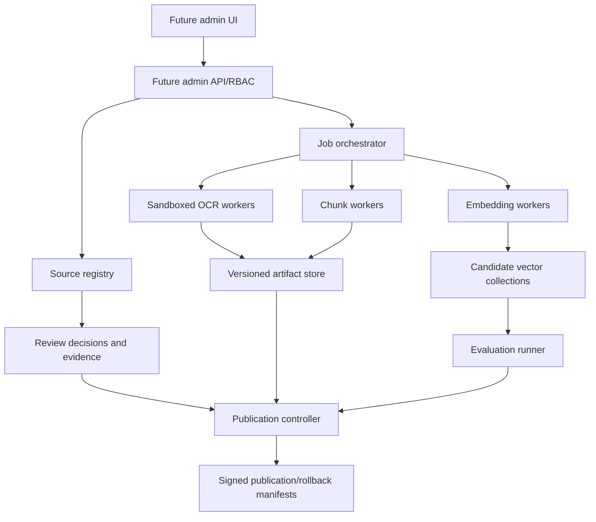

# Knowledge Studio Architecture

**Classification:** AUTHORITATIVE

Originals are immutable object artifacts keyed by checksum. Registry data and review
events are transactional. Workers have least privilege and do not approve their output.
Candidate collections are isolated from DA. Publication promotes references atomically;
it never copies an unreviewed working directory into production.

`backend/ingestion.registry` is the KS-01 local registry/intake boundary. It provides
atomic content-addressed originals, JSON persistence, and append-only intake events, but
has no admin identity/RBAC and is not a production service. Older OCR/classification/
chunk/embedding modules are deprecated migration evidence and are not invoked by KS-01.
